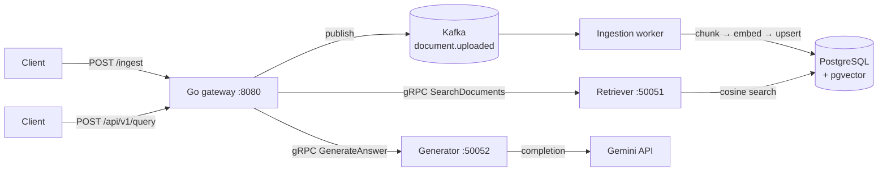

# Cortex

A retrieval-augmented generation service where **every citation in the response points
at a chunk the system actually retrieved**.

You POST a document; it is chunked, embedded into 384-dimensional vectors, and stored
in PostgreSQL with pgvector. You POST a question; the nearest chunks are retrieved by
cosine similarity, handed to Gemini along with the question, and returned as an answer
with citations. Citations naming a `chunk_id` that was not in the retrieved set are
stripped server-side before the response leaves the process — the model can misremember
a source, but it cannot invent one that was never in its context.

[](https://github.com/KlutzyFella/cortex/actions/workflows/ci.yml)
[](https://go.dev)
[](https://python.org)
[](https://github.com/pgvector/pgvector)
[](https://kafka.apache.org)
[](https://grpc.io)
[](LICENSE)

---

## Architecture

A Go gateway owns the public HTTP surface and orchestration. The RAG work is split
across three Python services that talk to the gateway over gRPC, with a single protobuf
contract defining the boundary.



Ingestion is asynchronous and query is synchronous. `POST /ingest` returns `202`
as soon as the message is on the topic; `POST /api/v1/query` calls the retriever and
generator inline under a single shared 30-second deadline.

The contract lives in [`proto/cortex/v1/cortex.proto`](proto/cortex/v1/cortex.proto)
and is the only coupling between Go and Python. Go stubs are generated by `buf`,
Python stubs by `grpc_tools.protoc`; both are committed.

---

## Quickstart

**Prerequisites:** Go 1.26.1, Python 3.12+, [`uv`](https://docs.astral.sh/uv/),
Docker (for Postgres and Kafka), and a `GOOGLE_API_KEY`.

```bash
git clone https://github.com/KlutzyFella/cortex.git
cd cortex

uv sync --all-packages            # Python deps for all three services
export DB_PASSWORD=cortex_dev     # required by the retriever and ingestion worker
export GOOGLE_API_KEY=...         # required by the generator

make run
```

`make run` brings up Postgres and Kafka, creates the `document.uploaded` topic,
starts the three Python services and the gateway **in dependency order**, and waits
until each is actually listening before starting the next — so it does not report
success until `/healthz` answers. Cold start to serving takes about 25 seconds. Logs
go to `logs/<service>.log`; `Ctrl-C` stops the services and leaves the containers
running (`make down` stops those too).

To follow the logs from a second terminal:

```bash
make logs
```

Without a `GOOGLE_API_KEY` you can still exercise ingestion and retrieval, neither of
which calls the LLM. Queries return `503` until the generator is running:

```bash
SKIP_GENERATOR=1 make run
```

Now ingest a document and query it:

```bash
curl -X POST localhost:8080/ingest \
  -d '{"doc_id":"doc-1","content":"Cortex stores vectors in pgvector and retrieves them by cosine distance."}'
# {"status":"accepted","doc_id":"doc-1"}

curl -X POST localhost:8080/api/v1/query -d '{"query":"How does Cortex search?","top_k":3}'
```

The query endpoint returns the answer, a `grounded` flag, the validated `citations`,
and the `chunks` that were retrieved.

Ingestion is asynchronous, so allow a second or two between the two calls. The
database schema is created by the ingestion worker on first connect, so querying
before anything has been indexed returns `404` rather than an empty answer.

---

## API

| Method | Path                 | Purpose                                            |
| ------ | -------------------- | -------------------------------------------------- |
| `GET`  | `/healthz`           | Liveness probe. Returns `{"status":"ok"}`          |
| `POST` | `/ingest`            | Publishes a document to Kafka. Returns `202`        |
| `POST` | `/api/v1/query`      | Full RAG pipeline: retrieve, then generate          |

**`POST /ingest`** — body `{ "doc_id": "doc-1", "content": "..." }`.
Returns `202 Accepted` once the message is enqueued to `document.uploaded`.

**`POST /api/v1/query`** — body `{ "query": "...", "top_k": 3 }`. `top_k` defaults to 5.
Returns:

```json
{
  "answer": "Cortex retrieves chunks using pgvector cosine distance.",
  "grounded": true,
  "citations": [{ "chunk_id": "42", "document_id": "doc-1", "excerpt": "..." }],
  "chunks":    [{ "chunk_id": "42", "document_id": "doc-1", "content": "...", "score": 0.81 }]
}
```

`score` is cosine similarity in `[0, 1]` — the code converts pgvector's distance with
`1 - (embedding <=> query)` so that 1 means identical.

Failures report the status that actually applies rather than a blanket `502`. A
query against an empty index returns `404` with an explanation (the generator is
never called with zero chunks), a downstream `INVALID_ARGUMENT` becomes `400`,
`UNAVAILABLE` becomes `503`, and a deadline becomes `504`.

---

## Configuration

Every setting is an environment variable with a default, except the two marked
**required**, which fail fast at startup rather than connecting with a guess.

**Gateway** (`gateway/main.go`)

| Variable         | Default                 | Controls                    |
| ---------------- | ----------------------- | --------------------------- |
| `GATEWAY_PORT`   | `8080`                  | HTTP listen port            |
| `KAFKA_ADDR`     | `localhost:9092`        | Broker for ingestion events  |
| `KAFKA_TOPIC`    | `document.uploaded`     | Topic published to          |
| `RETRIEVER_ADDR` | `localhost:50051`       | Retriever gRPC target       |
| `GENERATOR_ADDR` | `localhost:50052`       | Generator gRPC target       |

**Retriever** (`services/retriever/config.py`)

| Variable          | Default           | Controls                             |
| ----------------- | ----------------- | ------------------------------------ |
| `DB_PASSWORD`     | **required**      | Postgres password                    |
| `DB_HOST`         | `localhost`       | Postgres host                        |
| `DB_PORT`         | `5432`            | Postgres port                        |
| `DB_USER`         | `cortex`          | Postgres user                        |
| `DB_NAME`         | `cortex`          | Postgres database                    |
| `GRPC_PORT`       | `50051`           | gRPC listen port                     |
| `EMBEDDING_MODEL` | `all-MiniLM-L6-v2`| Sentence embedding model             |

**Generator** (`services/generator/config.py`)

| Variable          | Default            | Controls                        |
| ----------------- | ------------------ | ------------------------------- |
| `GOOGLE_API_KEY`  | **required**       | Gemini API key                  |
| `GENERATOR_MODEL` | `gemini-2.5-flash` | Default model; overridable per request |
| `GRPC_PORT`       | `50052`            | gRPC listen port                |

**Ingestion worker** (`services/ingestion/config.py`)

| Variable                 | Default           | Controls                          |
| ------------------------ | ----------------- | --------------------------------- |
| `DB_PASSWORD`            | **required**      | Postgres password                 |
| `KAFKA_BOOTSTRAP_SERVERS`| `localhost:9092`  | Consumer group brokers           |
| `KAFKA_TOPIC`            | `document.uploaded`| Topic to consume                 |
| `KAFKA_GROUP_ID`         | `ingestion-worker`| Consumer group id                |
| `EMBEDDING_MODEL`        | `all-MiniLM-L6-v2`| Sentence embedding model          |
| `CHUNK_SIZE`             | `500`             | Characters per chunk              |
| `CHUNK_OVERLAP`          | `50`              | Overlap between chunks            |
| `DB_HOST` / `DB_PORT` / `DB_USER` / `DB_NAME` | same as retriever | Postgres connection |

`CHUNK_OVERLAP` must be less than `CHUNK_SIZE`; the config dataclass rejects anything
else at construction.

---

## Project layout

```
cortex/
├── proto/cortex/v1/cortex.proto   # the Go ↔ Python contract
├── gateway/                       # Go HTTP gateway + Kafka producer
│   ├── main.go                    #   endpoints, wiring, graceful shutdown
│   └── gen/                       #   buf-generated Go stubs (committed)
├── services/
│   ├── ingestion/                 # Kafka consumer: chunk → embed → upsert
│   │   ├── main.py  processor.py  embedder.py  db.py  config.py
│   │   └── tests/                 #   unit + integration tests
│   ├── retriever/                 # gRPC :50051, pgvector cosine search
│   └── generator/                 # gRPC :50052, Gemini + citation validation
│       ├── llm.py                 #   prompt, structured output, validation
│       └── tests/                 #   citation validation tests
├── infra/
│   ├── local/docker-compose.yml   # Postgres + Kafka for development
│   └── terraform/                 # AWS scaffolding (no resources defined yet)
├── scripts/run-dev.sh             # what `make run` calls
├── Makefile                       # run / up / down / logs / proto / clean
└── .github/workflows/ci.yml
```

---

## Development

```bash
make run                  # full stack in dependency order, waits until serving
make logs                 # tail logs/<service>.log
make up / make down       # just Postgres + Kafka
make proto                # regenerate Go and Python gRPC stubs (needs buf)
make clean                # remove generated stubs

uv run ruff check .              # lint
uv run pytest services/ingestion -m "not integration" -q   # ingestion unit tests
uv run pytest services/generator -q                        # generator unit tests
uv run pytest services/ingestion                           # adds integration tests
                                                          # — needs a live Postgres
```

Tests split into two tiers. Unit tests cover chunking, embedding dimension validation,
schema/constraint behaviour, and the generator's citation validation; integration
tests are marked and exercise a real PostgreSQL + pgvector instance. Only the unit
tier runs in CI.

> The three services share flat top-level module names (`config`, `db`, `embedder`,
> `llm`), so exactly one service root can be on `sys.path` per run — otherwise
> `import config` resolves to whichever service was collected first. That is why
> `pythonpath` is pinned per service rather than left to the editable installs, and
> why each suite gets its own `pytest` invocation instead of one combined sweep.

Go tests live alongside the gateway and run with `go test ./...` from `gateway/`.

CI runs four checks: `ruff`, a lockfile-drift check (`uv lock --check`), `go build`
plus `go vet` plus `go test` plus `gofmt` on the gateway, and the Python unit tests
for both services.

---

## Design notes

**The contract is the architecture.** `cortex.proto` is the only thing the Go gateway
knows about Python. Adding a field is a schema change; changing an implementation is
not. Both sides generate from the same file, so drift is a compile error rather than a
runtime surprise.

**Ingestion is at-least-once, and deliberately so.** The worker commits its Kafka
offset manually, only after the database write succeeds. A crash mid-document replays
the message rather than dropping it. `upsert_chunks` removes chunks that are no longer
present, so re-ingesting a corrected document converges instead of duplicating.

**Citation validation is an invariant, not a prompt instruction.** The generator
builds the set of `chunk_id`s it actually supplied, then filters the model's
structured output against that set. Hallucinated references are stripped and logged.
Telling the model not to hallucinate is a request; filtering its output is a guarantee.

**Embedding dimensions are checked at startup.** `load_model` compares the model's
output dimension against the 384 the schema expects and refuses to boot on a mismatch.
The alternative — discovering it on the first user query — is a much worse failure.

**One deadline across both RPCs.** The gateway gives retrieval and generation a single
shared 30-second budget rather than 30 seconds each, so a slow retriever cannot silently
consume the generator's allowance.

**Shutdown is ordered.** `SIGINT`/`SIGTERM` stops the HTTP server, flushes the Kafka
producer for up to 5 seconds, then closes the gRPC connections — in-flight messages are
delivered before the process exits.

---

## License

[MIT](LICENSE)
